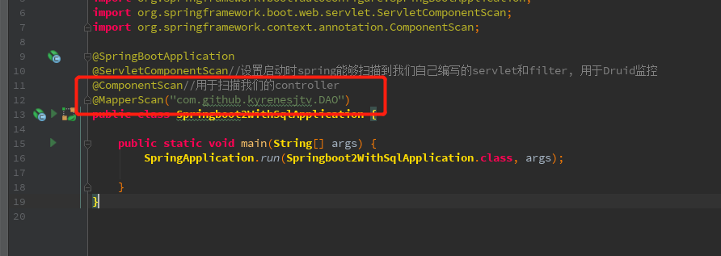

## 因为绝大部分操作数据库都是用Mybatis,这里我就加入了Mybatis

### 首先肯定就是POM文件了，下面是我引入的部分
```

        <druid.version>1.1.10</druid.version>
    	<mybatis-spring-boot-starter.version>1.3.1</mybatis-spring-boot-starter.version>

        <!-- add  -->

		<!-- https://mvnrepository.com/artifact/mysql/mysql-connector-java -->
		<dependency>
			<groupId>mysql</groupId>
			<artifactId>mysql-connector-java</artifactId>
		</dependency>

		<!-- https://mvnrepository.com/artifact/com.alibaba/druid -->
		<dependency>
			<groupId>com.alibaba</groupId>
			<artifactId>druid</artifactId>
			<version>${druid.version}</version>
		</dependency>
		<!-- https://mvnrepository.com/artifact/org.mybatis.spring.boot/mybatis-spring-boot-starter -->
		<dependency>
			<groupId>org.mybatis.spring.boot</groupId>
			<artifactId>mybatis-spring-boot-starter</artifactId>
			<version>${mybatis-spring-boot-starter.version}</version>
		</dependency>
```

### 我们接下来要新建下图的两个文件,以及对应的两个文件的内容


```
package com.github.kyrenesjtv.config.durid;

import com.alibaba.druid.pool.DruidDataSource;
import com.alibaba.druid.support.http.StatViewServlet;
import com.alibaba.druid.support.http.WebStatFilter;
import com.alibaba.druid.support.spring.stat.DruidStatInterceptor;
import org.springframework.aop.framework.autoproxy.BeanNameAutoProxyCreator;
import org.springframework.boot.web.servlet.FilterRegistrationBean;
import org.springframework.boot.web.servlet.ServletRegistrationBean;
import org.springframework.context.EnvironmentAware;
import org.springframework.context.annotation.Bean;
import org.springframework.context.annotation.Configuration;
import org.springframework.core.env.Environment;
import org.springframework.transaction.annotation.EnableTransactionManagement;

import javax.sql.DataSource;
import java.sql.SQLException;
import java.util.HashMap;
import java.util.Map;

/**
 * @ProjectName: springboot2
 * @Author: wanglin
 * @CreateDate: 2018/6/20 18:21
 */
@Configuration
@EnableTransactionManagement
public class DruidDataSourceConfig implements EnvironmentAware {

    //2.0之后用这种方法，直接getProperty
    private  Environment environment;

    @Override
    public void setEnvironment(Environment environment) {
        this.environment=environment;
    }

    @Bean
    public DataSource dataSource() {
        DruidDataSource datasource = new DruidDataSource();
        datasource.setUrl(environment.getProperty("spring.datasource.url"));
        datasource.setDriverClassName(environment.getProperty("spring.datasource.driverClassName"));
        datasource.setUsername(environment.getProperty("spring.datasource.username"));
        datasource.setPassword(environment.getProperty("spring.datasource.password"));
        datasource.setInitialSize(Integer.valueOf(environment.getProperty("spring.datasource.initialSize")));
        datasource.setMinIdle(Integer.valueOf(environment.getProperty("spring.datasource.minIdle")));
        datasource.setMaxWait(Long.valueOf(environment.getProperty("spring.datasource.maxWait")));
        datasource.setMaxActive(Integer.valueOf(environment.getProperty("spring.datasource.maxActive")));
        datasource.setMinEvictableIdleTimeMillis(
                Long.valueOf(environment.getProperty("spring.datasource.minEvictableIdleTimeMillis")));
        try {
            datasource.setFilters("stat,wall");
        } catch (SQLException e) {
            e.printStackTrace();
        }
        return datasource;
    }


    @Bean
    public ServletRegistrationBean druidServlet() {
        ServletRegistrationBean servletRegistrationBean = new ServletRegistrationBean();
        servletRegistrationBean.setServlet(new StatViewServlet());
        servletRegistrationBean.addUrlMappings("/druid/*");
        Map<String, String> initParameters = new HashMap<String, String>();
        // initParameters.put("loginUsername", "druid");// 用户名
        // initParameters.put("loginPassword", "druid");// 密码
        initParameters.put("resetEnable", "false");// 禁用HTML页面上的“Reset All”功能
        initParameters.put("allow", "127.0.0.1"); // IP白名单 (没有配置或者为空，则允许所有访问)
        // initParameters.put("deny", "192.168.20.38");// IP黑名单
        // (存在共同时，deny优先于allow)
        servletRegistrationBean.setInitParameters(initParameters);
        return servletRegistrationBean;
    }

    @Bean
    public FilterRegistrationBean filterRegistrationBean() {
        FilterRegistrationBean filterRegistrationBean = new FilterRegistrationBean();
        filterRegistrationBean.setFilter(new WebStatFilter());
        filterRegistrationBean.addUrlPatterns("/*");
        filterRegistrationBean.addInitParameter("exclusions", "*.js,*.gif,*.jpg,*.bmp,*.png,*.css,*.ico,/druid/*");
        return filterRegistrationBean;
    }

    // 按照BeanId来拦截配置 用来bean的监控
    @Bean(value = "druid-stat-interceptor")
    public DruidStatInterceptor DruidStatInterceptor() {
        DruidStatInterceptor druidStatInterceptor = new DruidStatInterceptor();
        return druidStatInterceptor;
    }

    @Bean
    public BeanNameAutoProxyCreator beanNameAutoProxyCreator() {
        BeanNameAutoProxyCreator beanNameAutoProxyCreator = new BeanNameAutoProxyCreator();
        beanNameAutoProxyCreator.setProxyTargetClass(true);
        // 设置要监控的bean的id
        //beanNameAutoProxyCreator.setBeanNames("sysRoleMapper","loginController");
        beanNameAutoProxyCreator.setInterceptorNames("druid-stat-interceptor");
        return beanNameAutoProxyCreator;
    }
}

```


```
mybatis.mapper-locations: classpath:mapper/*.xml
# 数据库访问配置
# 主数据源，默认的
spring.datasource.type = com.alibaba.druid.pool.DruidDataSource
spring.datasource.driverClassName = com.mysql.jdbc.Driver
spring.datasource.url = jdbc:mysql://127.0.0.1:3306/demo?useUnicode=true&characterEncoding=gbk&zeroDateTimeBehavior=convertToNull
spring.datasource.username = root
spring.datasource.password = root

# 下面为连接池的补充设置，应用到上面所有数据源中
# 初始化大小，最小，最大
spring.datasource.initialSize = 5
spring.datasource.minIdle = 5
spring.datasource.maxActive = 20
# 配置获取连接等待超时的时间
spring.datasource.maxWait = 60000
# 配置间隔多久才进行一次检测，检测需要关闭的空闲连接，单位是毫秒
spring.datasource.timeBetweenEvictionRunsMillis = 60000
# 配置一个连接在池中最小生存的时间，单位是毫秒
spring.datasource.minEvictableIdleTimeMillis = 300000
spring.datasource.validationQuery = select 1
spring.datasource.testWhileIdle = true
spring.datasource.testOnBorrow = false
spring.datasource.testOnReturn = false
# 打开PSCache，并且指定每个连接上PSCache的大小
spring.datasource.poolPreparedStatements = true
spring.datasource.maxPoolPreparedStatementPerConnectionSize = 20
# 配置监控统计拦截的filters，去掉后监控界面sql无法统计，'wall'用于防火墙
spring.datasource.filters = stat, wall, log4j
# 通过connectProperties属性来打开mergeSql功能；慢SQL记录
spring.datasource.connectionProperties = druid.stat.mergeSql = true; druid.stat.slowSqlMillis = 5000
# 合并多个DruidDataSource的监控数据
# spring.datasource.useGlobalDataSourceStat = true
```

### 当然了，这样子还是不够的，我们要在启动类中添加注解


### 那么接下来呢，就是去写一下我们简单的逻辑

#### contrller

```
package com.github.kyrenesjtv.controller;

import com.github.kyrenesjtv.po.User;
import com.github.kyrenesjtv.service.impl.UserServiceIMPL;
import org.springframework.beans.factory.annotation.Autowired;
import org.springframework.web.bind.annotation.*;

import java.util.List;

/**
 * @ProjectName: springboot2
 * @Author: wanglin
 * @CreateDate: 2018/6/21 18:21
 */
@RestController
@RequestMapping(value = "/users")
public class UserController {

    @Autowired
    private UserServiceIMPL userServiceIMPL;


    @RequestMapping(value = "/", method = RequestMethod.GET)
    public List<User> getAllUsers() {
        return userServiceIMPL.getAllUsers();
    }

    @RequestMapping(value = "/{id}", method = RequestMethod.GET)
    public User getUserByID(@PathVariable int id) {
        return userServiceIMPL.getUserByID(id) ;
    }

    @RequestMapping(value = "/{id}", method = RequestMethod.PUT)
    public int updateUserByID(@PathVariable int id, @ModelAttribute User user) {
        User user1 = userServiceIMPL.getUserByID(id);
        if (user != null) {
            user1.setAge(user.getAge());
            user1.setName(user.getName());
        }
        return userServiceIMPL.updateUserByID(user1);
    }

    @RequestMapping(value = "/{id}", method = RequestMethod.DELETE)
    public int deleteUserByID(@PathVariable int id) {
        return userServiceIMPL.deleteUserByID(id);
    }

    @RequestMapping(value = "/", method = RequestMethod.POST)
    public int insertUser(@ModelAttribute User user) {
        int i = userServiceIMPL.insertUser(user);
        System.out.println("================    "+ user.getId() +" =====================");
        System.out.println("================    "+ i +" =====================");
        return i;
    }
}

```

#### service
```
package com.github.kyrenesjtv.service.impl;

import com.github.kyrenesjtv.DAO.UserDAO;
import com.github.kyrenesjtv.po.User;
import com.github.kyrenesjtv.service.IUserService;
import org.springframework.beans.factory.annotation.Autowired;
import org.springframework.stereotype.Service;

import java.util.List;

/**
 * @ProjectName: springboot2
 * @Author: wanglin
 * @CreateDate: 2018/6/21 18:21
 */
@Service
public class UserServiceIMPL implements IUserService {
    @Autowired
    private UserDAO userDAO;

    @Override
    public List<User> getAllUsers() {
        return userDAO.getAllUsers();
    }

    @Override
    public User getUserByID(int id) {
        return userDAO.getUserByID(id);
    }

    @Override
    public int updateUserByID(User user) {
        return userDAO.updateUserByID(user);
    }

    @Override
    public int deleteUserByID(int id) {
        return userDAO.deleteUserByID(id);
    }

    @Override
    public int insertUser(User user) {
        return userDAO.insertUser(user);
    }
}

```

#### DAO

```
package com.github.kyrenesjtv.DAO;


import com.github.kyrenesjtv.po.User;

import java.util.List;

/**
 * @ProjectName: springboot2
 * @Author: wanglin
 * @CreateDate: 2018/6/21 18:21
 */
public interface UserDAO {
    /**
     * 返回所有的users
     *
     * @return
     */
    List<User> getAllUsers();

    /**
     * 通过id寻找User
     *
     * @param id
     * @return
     */
    User getUserByID(int id);

    /**
     * 更新用户
     *
     * @param user
     * @return
     */
    int updateUserByID(User user);

    /**
     * 通过id删除用户
     *
     * @param id
     * @return
     */
    int deleteUserByID(int id);

    /**
     * 创建用户
     *
     * @param user
     * @return
     */
    int insertUser(User user);
}

```

#### mapper
```
<?xml version="1.0" encoding="UTF-8"?>
<!DOCTYPE mapper PUBLIC "-//mybatis.org//DTD Mapper 3.0//EN" "http://mybatis.org/dtd/mybatis-3-mapper.dtd">
<mapper namespace="com.github.kyrenesjtv.DAO.UserDAO">

    <resultMap id="BaseResultMap" type="com.github.kyrenesjtv.po.User">
        <id column="id" property="id" jdbcType="INTEGER"/>
        <result column="name" property="name" jdbcType="VARCHAR"/>
        <result column="age" property="age" jdbcType="INTEGER"/>
    </resultMap>
    <sql id="Base_Column_List">
        id, name, age
    </sql>
    <select id="getAllUsers" resultMap="BaseResultMap">
        select
        <include refid="Base_Column_List"/>
        from tb_user;
    </select>

    <select id="getUserByID" resultMap="BaseResultMap" parameterType="java.lang.Integer">
        select
        <include refid="Base_Column_List"/>
        from tb_user where id = #{id};
    </select>

    <update id="updateUserByID" parameterType="com.github.kyrenesjtv.po.User">
        update tb_user
        <set>
            <trim suffixOverrides=",">
                <if test="name != null">
                    name = #{name,jdbcType=VARCHAR},
                </if>
                <if test="age != null">
                    age = #{age,jdbcType=INTEGER},
                </if>
            </trim>
        </set>
        where id = #{id,jdbcType=BIGINT}
    </update>

    <delete id="deleteUserByID" parameterType="java.lang.Integer">
    delete from tb_user
    where id = #{id,jdbcType=INTEGER}
  </delete>

    <insert id="insertUser"   parameterType="com.github.kyrenesjtv.po.User">

        <selectKey resultType="java.lang.Integer" order="AFTER" keyProperty="id">
            SELECT LAST_INSERT_ID() AS id
        </selectKey>
        insert into tb_user
        <trim prefix="(" suffix=")" suffixOverrides=",">
            <if test="name != null">
                name,
            </if>
            <if test="age != null">
                age,
            </if>
        </trim>
        <trim prefix="values (" suffix=")" suffixOverrides=",">
            <if test="name != null">
                #{name,jdbcType=VARCHAR},
            </if>
            <if test="age != null">
                #{age,jdbcType=INTEGER},
            </if>
        </trim>
    </insert>
</mapper>
```

### 对了，到这里的时候千万不要忘记了，要在启动类中添加注解,不然会找不到你DAO的接口



### 最后是项目的结构图


