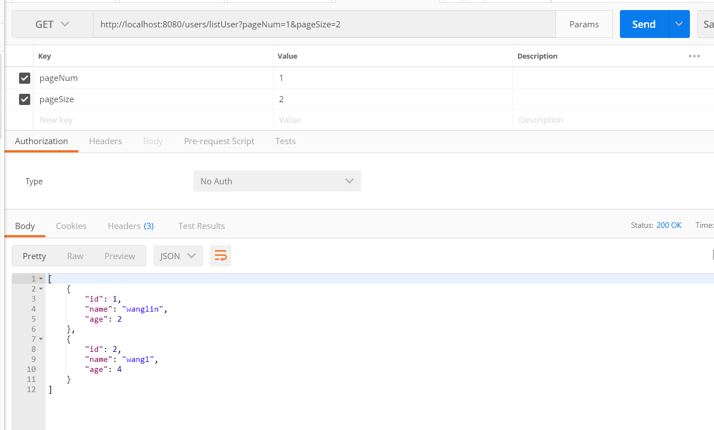
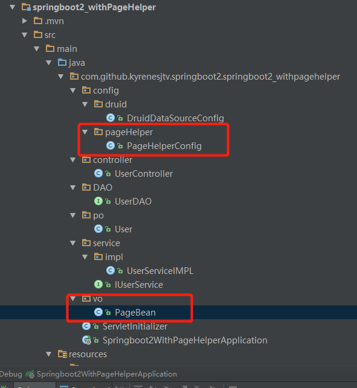

## 在springboot_withSQL基础上引入了pageHelper

### 我们先在pom文件中引入pageHelper
```
 <dependency>
              <groupId>com.github.pagehelper</groupId>
              <artifactId>pagehelper</artifactId>
              <version>4.1.6</version>
         </dependency>
```

### 然后，我们写一个配置,让spring启动的时候有pageHelper对象

```
package com.github.kyrenesjtv.springboot2.springboot2_withpagehelper.config.pageHelper;

import com.github.pagehelper.PageHelper;
import org.springframework.context.annotation.Bean;
import org.springframework.context.annotation.Configuration;
import org.springframework.transaction.annotation.EnableTransactionManagement;

import java.util.Properties;

/**
 * @ProjectName: springboot2
 * @Author: wanglin
 * @CreateDate: 2018/6/29 17:39
 */
@Configuration
@EnableTransactionManagement//事务注解
public class PageHelperConfig {
    //配置mybatis的分页插件pageHelper
    @Bean
    public PageHelper pageHelper(){
        PageHelper pageHelper = new PageHelper();
        Properties properties = new Properties();
        properties.setProperty("offsetAsPageNum","true");
        properties.setProperty("rowBoundsWithCount","true");
        properties.setProperty("reasonable","true");
        properties.setProperty("dialect","mysql");    //配置mysql数据库的方言
        pageHelper.setProperties(properties);
        return pageHelper;
    }
}

```

### 然后呢我们写逻辑咯

#### controller层
```
@RequestMapping(value = "/listUser", method = RequestMethod.GET)
    public List<User> getAllListUsers(int pageNum, int pageSize) {
        PageBean<User> allListUsers = userServiceIMPL.getAllListUsers(pageNum, pageSize);
        return allListUsers.getItems();
    }
```
#### service层
```
@Override
    public PageBean<User> getAllListUsers(int pageNum, int pageSize) {
        //使用分页插件,核心代码就这一行
        PageHelper.startPage(pageNum, pageSize);
        List<User> allUsers = userDAO.getAllUsers();
        PageBean<User> pageData = new PageBean<>(pageNum, pageSize, allUsers.size());
        pageData.setItems(allUsers);
        // 获取
//       userDAO.getAllUsers();
        return pageData;
    }
```

#### 当然了我们需要一个vo对象，来帮我们处理最大页数等等之类的
```
package com.github.kyrenesjtv.springboot2.springboot2_withpagehelper.vo;

import java.util.List;

/**
 * @ProjectName: springboot2
 * @Author: wanglin
 * @CreateDate: 2018/6/29 17:15
 */
public class PageBean<T> {
    // 当前页
    private Integer currentPage = 1;
    // 每页显示的总条数
    private Integer pageSize = 10;
    // 总条数
    private Integer totalNum;
    // 是否有下一页
    private Integer isMore;
    // 总页数
    private Integer totalPage;
    // 开始索引
    private Integer startIndex;
    // 分页结果
    private List<T> items;

    public PageBean() {
        super();
    }

    public PageBean(Integer currentPage, Integer pageSize, Integer totalNum) {
        super();
        this.currentPage = currentPage;
        this.pageSize = pageSize;
        this.totalNum = totalNum;
        this.totalPage = (this.totalNum+this.pageSize-1)/this.pageSize;
        this.startIndex = (this.currentPage-1)*this.pageSize;
        this.isMore = this.currentPage >= this.totalPage?0:1;
    }

    public Integer getCurrentPage() {
        return currentPage;
    }

    public void setCurrentPage(Integer currentPage) {
        this.currentPage = currentPage;
    }

    public Integer getPageSize() {
        return pageSize;
    }

    public void setPageSize(Integer pageSize) {
        this.pageSize = pageSize;
    }

    public Integer getTotalNum() {
        return totalNum;
    }

    public void setTotalNum(Integer totalNum) {
        this.totalNum = totalNum;
    }

    public Integer getIsMore() {
        return isMore;
    }

    public void setIsMore(Integer isMore) {
        this.isMore = isMore;
    }

    public Integer getTotalPage() {
        return totalPage;
    }

    public void setTotalPage(Integer totalPage) {
        this.totalPage = totalPage;
    }

    public Integer getStartIndex() {
        return startIndex;
    }

    public void setStartIndex(Integer startIndex) {
        this.startIndex = startIndex;
    }

    public List<T> getItems() {
        return items;
    }

    public void setItems(List<T> items) {
        this.items = items;
    }
}

```

### 接下来就是结果展示



### 对应的目录结构图



