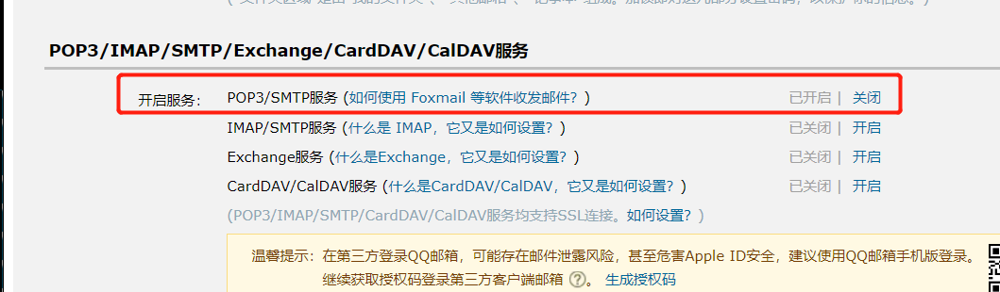

## 使用springboot自带的mail来发送邮件，我这里使用的是QQ邮箱，需要开启几个步骤

### 登录你的QQ邮箱，找到邮箱设置-账户，按照下图开启，开启后会有一个授权码，保留好等下会用到



### 接下来，我们在pom文件中引入依赖

```
        <dependency>
			<groupId>org.springframework.boot</groupId>
			<artifactId>spring-boot-starter-mail</artifactId>
		</dependency>
```

### 接下来就是在application.properties中配置mail的相关信息

```
#mail的设置
#邮箱
spring.mail.host=smtp.qq.com
#发送方邮箱
spring.mail.username=401442190@qq.com
#发送方的授权码(需要开启SMTP)
spring.mail.password=填写刚才的授权码
spring.mail.properties.mail.smtp.auth=true
spring.mail.properties.mail.smtp.ssl.enable=true
spring.mail.properties.mail.smtp.socketFactory.class=javax.net.ssl.SSLSocketFactory
#换成公司企业邮箱报错，通过将properties文件的内容修改（下面两个改成false）就可以了，这里的用户密码就是自己的邮箱密码(这点不同于qq邮箱)
spring.mail.properties.mail.smtp.starttls.enable=true
spring.mail.properties.mail.smtp.starttls.required=true
```

### 那么我们可以开始写一个简单的MailUtil

```
package com.github.kyrenesjtv.springboot2.springboot2_withmail.utils;

import org.springframework.core.io.FileSystemResource;
import org.springframework.mail.SimpleMailMessage;
import org.springframework.mail.javamail.JavaMailSenderImpl;
import org.springframework.mail.javamail.MimeMessageHelper;

import javax.mail.internet.MimeMessage;
import java.io.File;
import java.util.Properties;

/**
 * @ProjectName: springboot2
 * @Author: wanglin
 * @CreateDate: 2018/7/12 17:14
 */
public class MailUtil {
    //获取到mail对象
    private static JavaMailSenderImpl mailSender =null;

    private String from;

    private String to;

    private String subject;

    private String content;

    //    @Autowired
    //    public mailUtil(JavaMailSender mailSender) {
    //        this.mailSender = mailSender;
    //    }
    static {
        Properties properties = PropertyUtil.loadProperties("application.properties");
        String host = properties.getProperty("spring.mail.host");
        String username = properties.getProperty("spring.mail.username");
        String password = properties.getProperty("spring.mail.password");
        String auth = properties.getProperty("spring.mail.properties.mail.smtp.auth");
        String clazz = properties.getProperty("spring.mail.properties.mail.smtp.socketFactory.class");
        String ssl_enable = properties.getProperty("spring.mail.properties.mail.smtp.ssl.enable");
        String starttls_enable = properties.getProperty("spring.mail.properties.mail.smtp.starttls.enable");
        String required = properties.getProperty("spring.mail.properties.mail.smtp.starttls.required");
        mailSender =new JavaMailSenderImpl();
        // 设定mail server
        mailSender.setHost(host);
        mailSender.setPort(-1);
        mailSender.setUsername(username);// 根据自己的情况,设置发件邮箱地址
        mailSender.setPassword(password); // 根据自己的情况, 设置password
        mailSender.setDefaultEncoding("UTF-8");
        Properties prop = new Properties();
        prop.put("mail.smtp.auth", auth); // 将这个参数设为true，让服务器进行认证,认证用户名和密码是否正确
        prop.put("mail.smtp.ssl.enable", ssl_enable);
        prop.put("mail.smtp.socketFactory.class", clazz);
        mailSender.setJavaMailProperties(prop);
    }

    private MailUtil(String from, String to, String subject, String content) throws Exception {
        SimpleMailMessage message = new SimpleMailMessage();
        message.setFrom(from);
        message.setTo(to);
        message.setSubject(subject);
        message.setText(content);
        mailSender.send(message);
    }

    private MailUtil(String from, String to, String subject, String content, File file) throws Exception {
        MimeMessage message2 = mailSender.createMimeMessage();
        MimeMessageHelper helper = new MimeMessageHelper(message2, true);
        helper.setFrom(from);
        helper.setTo(to);
        helper.setSubject(subject);
        helper.setText(content);
        //加入附件
        helper.addAttachment(file.getName(), new FileSystemResource(file));
        mailSender.send(message2);
    }

    /**
     * 设置一些基本信息
     *
     * @param from    发送方
     * @param to      接收方
     * @param subject 邮件主题
     * @param content 邮件内容
     */
    public static void instance(String from, String to, String subject, String content) throws Exception {
        new MailUtil(from, to, subject, content);

    }

    /**
     * 带附件的邮件
     *
     * @param from    发送方
     * @param to      接收方
     * @param subject 邮件主题
     * @param content 邮件内容
     * @param file    附件
     * @throws Exception
     */
    public static void instance(String from, String to, String subject, String content, File file) throws Exception {
        new MailUtil(from, to, subject, content, file);
    }
}

```

### 最后可以调用util来发送短信，当然你自己可以预设好短信模板，再把自己想要发送短信的内容填充进去即可
