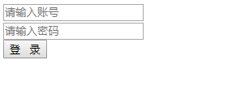
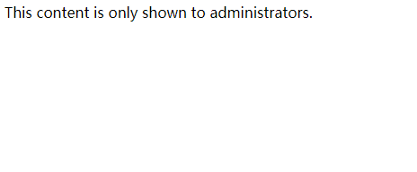
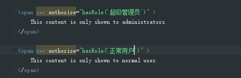
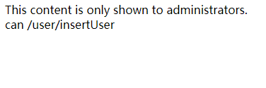
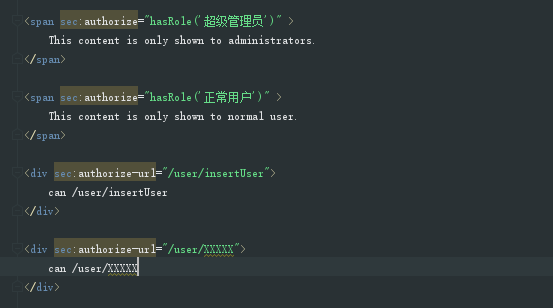

### springboot2集成springsecurity5 ，本次教程基于springboot2_withPageHelper , 但是项目的版本为2.1.4.RELEASE。 2.1.X为security5。2.0.X为security4。至于一些详细细节就不展示
#### [点击这里,查看源码](https://github.com/kyrenesjtv/springboot2/tree/master/springboot2_withsecurity) 

#### 在这里需要注意一点。spring.datasource.url = jdbc:mysql://127.0.0.1:3306/demo??useUnicode=true&characterEncoding=utf-8&zeroDateTimeBehavior=convertToNull&serverTimezone=GMT%2B8。 最后面不要忘记加serverTimezone=GMT%2B8。这个是2.1.X版本引起的

#### 在POM文件中引入以下文件

~~~
        <!-- security -->
        <dependency>
            <groupId>org.springframework.boot</groupId>
            <artifactId>spring-boot-starter-security</artifactId>
        </dependency>
        <dependency>
            <groupId>org.thymeleaf.extras</groupId>
            <artifactId>thymeleaf-extras-springsecurity5</artifactId>
        </dependency>
~~~

#### 接下来你访问你项目里的任意一个链接都会弹出这个界面。 用户名是user , 密码是你项目启动的时候在console中打印的随机字符串(但我这里没有打印也不知道为什么，不过这个都是无关紧要的)

 .jpg)
 
#### 那么我们接下来配置security

#### 1. 先配置最重要的文件WebSecurityConfig。 这是security里面核心的一个文件，这里面配置一些核心东西

~~~
@Configuration
@EnableWebSecurity
@EnableGlobalMethodSecurity(prePostEnabled = true)
public class WebSecurityConfig extends WebSecurityConfigurerAdapter {
    /**
     * 通过 实现UserDetailService 来进行验证
     */
    @Autowired
    private UserDetailsServiceImpl userDetailsServiceImpl;

    /**
     * 解决sec:authorize-url无作用
     */
    @Autowired
    private MyWebInvocationPrivilegeEvaluator myWebInvocationPrivilegeEvaluator;

    
    /**
     * @param auth
     * @throws Exception
     */
    @Autowired
    public void configureGlobal(AuthenticationManagerBuilder auth) throws Exception {

        //校验用户
        auth.userDetailsService(userDetailsServiceImpl)
                //校验密码
                .passwordEncoder(new PasswordEncoder() {

                    @Override
                    public String encode(CharSequence rawPassword) {
                        return MD5Util.md5(String.valueOf(rawPassword));
                    }

                    @Override
                    public boolean matches(CharSequence rawPassword, String encodedPassword) {
                        return encodedPassword.equals(MD5Util.md5(String.valueOf(rawPassword)));
                    }
                });
    }

    @Override
    public void configure(WebSecurity web) {
        web.privilegeEvaluator(myWebInvocationPrivilegeEvaluator);
    }

    /**
     * 创建自定义的表单
     * 

     * 页面、登录请求、跳转页面等
     *
     * @param http
     * @throws Exception
     */
    @Override
    protected void configure(HttpSecurity http) throws Exception {
        http.authorizeRequests()
                .antMatchers("/", "/login", "/static/**", "/templates/login.html")//允许访问
                .permitAll().anyRequest().authenticated()
                .and().formLogin().loginPage("/login")//拦截后get请求跳转的页面
                //                .loginProcessingUrl("/login/userLogin")
                .defaultSuccessUrl("/init", true)//登录成功之后的跳转Url
                //                .successForwardUrl("/common/init")
                .permitAll()
                //自定义用户名和密码
                //                .usernameParameter("userName")
                //                .passwordParameter("userPassword")
                .failureUrl("/login?error=true")//设置登录有错误返回login页面并进行提示
                .and().logout().invalidateHttpSession(false)//退出的时候清除session
                .permitAll();
        http.headers().frameOptions().sameOrigin();
        //关闭跨域保护？ post 请求开放 , 否则的话要在每一个post提交里面添加 "${_csrf.parameterName}":"${_csrf.token}"
        http.csrf().disable();

    }

}
~~~

#### 接下来我们需要自定义一个UserDetailsServiceImpl去实现UserDetailsService(security自带)来重写方法，来实现登录和加载角色

~~~
@Service
public class UserDetailsServiceImpl implements UserDetailsService {

    @Autowired
    private UserDAO userDAO;

    @Autowired
    private RoleDAO roleDAO;

    @Override
    public UserDetails loadUserByUsername(String s) throws UsernameNotFoundException {
        String id = userDAO.getUserIdByUserName(s);
        UserPO user = userDAO.getUserById(id);
        if(user == null){
            throw new UsernameNotFoundException(String.format("No user found with username '%s'.", s));
        }

        List<RolePO> rolePOS = roleDAO.listRolesByUserId(id);
        List<GrantedAuthority> authorities = new ArrayList<>();
        for (RolePO role : rolePOS) {
            authorities.add(new SimpleGrantedAuthority(role.getName()));
        }
        return new User(user.getLoginName(), user.getPassword(), authorities);
    }
}

~~~

#### 接下来需要有3个类来帮助我们重写一些方法，在登录的时候会起作用(配置完这三个类之后，可以在页面上实现基于角色控制代码是否显示)

##### 这种效果

~~~

  This content is only shown to administrators.

~~~

#### 第一个类，在打开登录页面的时候就会进行加载

~~~
@Component
public class MyInvocationSecurityMetadataSourceService implements FilterInvocationSecurityMetadataSource {

    @Autowired
    private RoleDAO roleDao;

    /**
     * 每一个资源所需要的角色
     */
    public  static HashMap<String, Collection<ConfigAttribute>> map =null;

    public void loadResourceDefine(){

        map = new HashMap<>();

        //权限资源 和 角色对应的表  也就是 角色 权限中间表
        List<RoleFunctionPO> rolePermissons = roleDao.listAllRoleFunction();

        //每个资源 所需要的权限
        for (RoleFunctionPO rolePermisson : rolePermissons) {
            String url = rolePermisson.getFunctionAddress();
            String roleName = rolePermisson.getRoleName();
            ConfigAttribute role = new SecurityConfig(roleName);
            if(map.containsKey(url)){
                map.get(url).add(role);
            }else{
                map.put(url,new ArrayList<ConfigAttribute>(){{
                    add(role);
                }});
            }
        }
    }

    /**
     * @param object
     * @return
     * @throws IllegalArgumentException
     */
    @Override
    public Collection<ConfigAttribute> getAttributes(Object object) throws IllegalArgumentException {
        if(map ==null){
            loadResourceDefine();
        }
        //object 中包含用户请求的request 信息
        HttpServletRequest request = ((FilterInvocation) object).getHttpRequest();
        for(Iterator<String> iter = map.keySet().iterator(); iter.hasNext(); ) {
            String url = iter.next();
            if(new AntPathRequestMatcher(url).matches(request)) {
                return map.get(url);
            }
        }
        return null;
    }

    @Override
    public Collection<ConfigAttribute> getAllConfigAttributes() {
        return null;
    }

    @Override
    public boolean supports(Class<?> clazz) {
        return true;
    }
}
~~~

#### 第二个类则是承上启下的类

~~~
@Component
public class MyFilterSecurityInterceptor extends AbstractSecurityInterceptor implements Filter {

    @Autowired
    private FilterInvocationSecurityMetadataSource securityMetadataSource;

    @Autowired
    public void setMyAccessDecisionManager(MyAccessDecisionManager myAccessDecisionManager) {
        super.setAccessDecisionManager(myAccessDecisionManager);
    }

    @Override
    public void init(FilterConfig filterConfig) throws ServletException {

    }

    @Override
    public void doFilter(ServletRequest request, ServletResponse response, FilterChain chain) throws IOException, ServletException {

        FilterInvocation fi = new FilterInvocation(request, response, chain);
        invoke(fi);
    }

    public void invoke(FilterInvocation fi) throws IOException, ServletException {

        InterceptorStatusToken token = super.beforeInvocation(fi);
        try {
            //执行下一个拦截器
            fi.getChain().doFilter(fi.getRequest(), fi.getResponse());
        } finally {
            super.afterInvocation(token, null);
        }
    }

    @Override
    public void destroy() {

    }

    @Override
    public Class<?> getSecureObjectClass() {
        return FilterInvocation.class;
    }

    @Override
    public SecurityMetadataSource obtainSecurityMetadataSource() {
        return this.securityMetadataSource;
    }
}
~~~

#### 第三个类则是我刚才说的是否显示的标签的至关重要的一个类，来判断你打开的页面的标签(security标签库引入的)

~~~
@Component
public class MyAccessDecisionManager implements AccessDecisionManager {

    private final static Logger logger = LoggerFactory.getLogger(MyAccessDecisionManager.class);

    /**
     * 判定 是否含有权限
     * @param authentication  CustomUserService.loadUserByUsername() 封装的用户信息
     * @param object    request请求信息
     * @param configAttributes InvocationSecurityMetadataSourceService.getAttributes()  中每个资源可访问的角色集合
     * @throws AccessDeniedException
     * @throws InsufficientAuthenticationException
     */
    @Override
    public void decide(Authentication authentication, Object object, Collection<ConfigAttribute> configAttributes) throws AccessDeniedException, InsufficientAuthenticationException {

        if(null== configAttributes || configAttributes.size() <=0) {
            return;
        }
        String needRole;
        List<ConfigAttribute> configAttributes1 = new ArrayList<>();
        configAttributes1.addAll(configAttributes);
        for(Iterator<ConfigAttribute> iter = configAttributes.iterator(); iter.hasNext(); ) {
            needRole = iter.next().getAttribute();
            for(GrantedAuthority ga : authentication.getAuthorities()) {
                logger.info("GrantedAuthority:"+ga.getAuthority().trim());
                if(needRole.trim().equals(ga.getAuthority().trim())) {
                    return;
                }
            }
        }
        throw new AccessDeniedException("no privilege");
    }

    @Override
    public boolean supports(ConfigAttribute attribute) {
        return true;
    }

    @Override
    public boolean supports(Class<?> clazz) {
        return true;
    }

}

~~~

#### 接下来我们打开页面http://127.0.0.1:8080/login 可以看到简陋的登录

#### 输入admin  dd123456 可以看到页面。这里我使用超级管理员账号登录，可见，我看不到第二个span。这里我尝试了很多次，很多都不是规范的代码。我这里就不是ROLE_超级管理员（sec:authorize="hasRole('ROLE_超级管理员')"）。你可以多尝试一下

##### 这里需要注意的一点事，需要在头部引入标签库

~~~
<html lang="en" xmlns="http://www.w3.org/1999/xhtml" xmlns:th="http://www.thymeleaf.org" xmlns:sec="http://www.thymeleaf.org/thymeleaf-extras-springsecurity5">
~~~

#### ok， 那我们现在基于URL来进行访问，这样子就避免了角色引起的问题

#### 写我们第四个文件，这里我把网上的代码重写一遍，因为网上的并不能实现我想要的结果

~~~
@Component
public class MyWebInvocationPrivilegeEvaluator extends DefaultWebInvocationPrivilegeEvaluator {

    public MyWebInvocationPrivilegeEvaluator(AbstractSecurityInterceptor securityInterceptor) {
        super(securityInterceptor);
    }

    @Override
    public boolean isAllowed(String uri, Authentication authentication) {
        return super.isAllowed(uri, authentication);
    }

    @Override
    public boolean isAllowed(String contextPath, String uri, String method, Authentication authentication) {
        //重写原来的方法
        Map<String, Collection<ConfigAttribute>> map = MyInvocationSecurityMetadataSourceService.map;
        //先判断url
        List<ConfigAttribute> uri1 = (List<ConfigAttribute>) map.get(uri);
        //再判断角色
        List<GrantedAuthority> authorities = (List<GrantedAuthority>) authentication.getAuthorities();

        if(uri1 == null || uri1.size() == 0){
            return false;
        }
        if(uri1 == null || uri1.size() == 0){
            return false;
        }

        Boolean result = false;
        for(ConfigAttribute c :uri1){
            for(GrantedAuthority g :authorities){
                if(c.getAttribute().equals(g.getAuthority())){
                    result=true;
                }
            }
        }
        return result;
        //下面的注释掉
//        return super.isAllowed(contextPath, uri, method, authentication);

    }
}
~~~

##### 我们进行登录,发现我们能看到他有这个url的

#### 写在最后，我这边的登录成功后跳转路径为init，所以数据库里面必须也要有/init，用户也必须拥有，才能够访问到init页面。不然是会报错的。然后还有另外需要记住一点，只要sec:authorize-url="/admin/foo" 你加了这个url判断，数据库必须要有这个url。

#### WebSecurityConfig里面的http.headers().frameOptions().sameOrigin();。是能够让iframe正确刷新。

#### 还有最后是不是觉得，没有判断用户密码？ 其实security已经帮我们做了，WebSecurityConfig里面的configureGlobal这个方法，就帮我们判断了，如果密码不对，会报错。然后只要WebSecurityConfig里面的 (.failureUrl("/login?error=true")//设置登录有错误返回login页面并进行提示)这个会帮我们进行提示，只需要在登录界面加上这一串代码就行div th:if="${param.error}" >用户名或密码错误</div

#### 这里我还没有实现自定义登录页面登录。后续会不上，现在世界是POST提交，然后security自己就会帮我们处理好