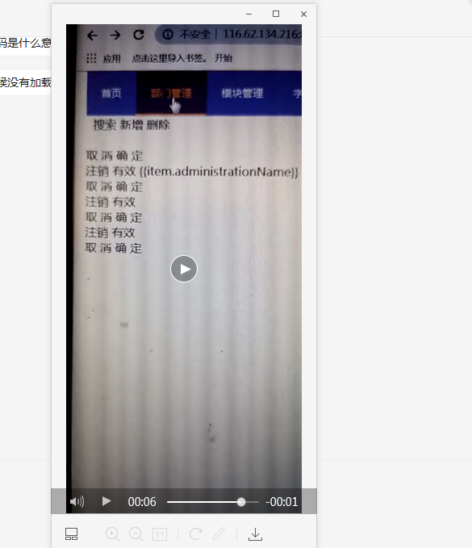

#### 1.ELEMENT隐藏组件 <el-scrollbar style="height: 90%">*****</el-scrollbar> 加上这个之后就可以有ELEMENT的滚动条,还要有下面的CSS

~~~
.el-scrollbar .el-scrollbar__wrap {
        overflow-x: hidden;
    }
~~~

#### 2.用VUE+ELEMENT的时候，刷新或点击页面的时候无法立即加载CSS

 
#### 解决办法 ，加上CSS, 然后在你VUE的el:"#div" 的那个DIV上面加上v-cloak就不会有上图的那个情况

~~~
 [v-cloak] {
        display: none;
    }
~~~