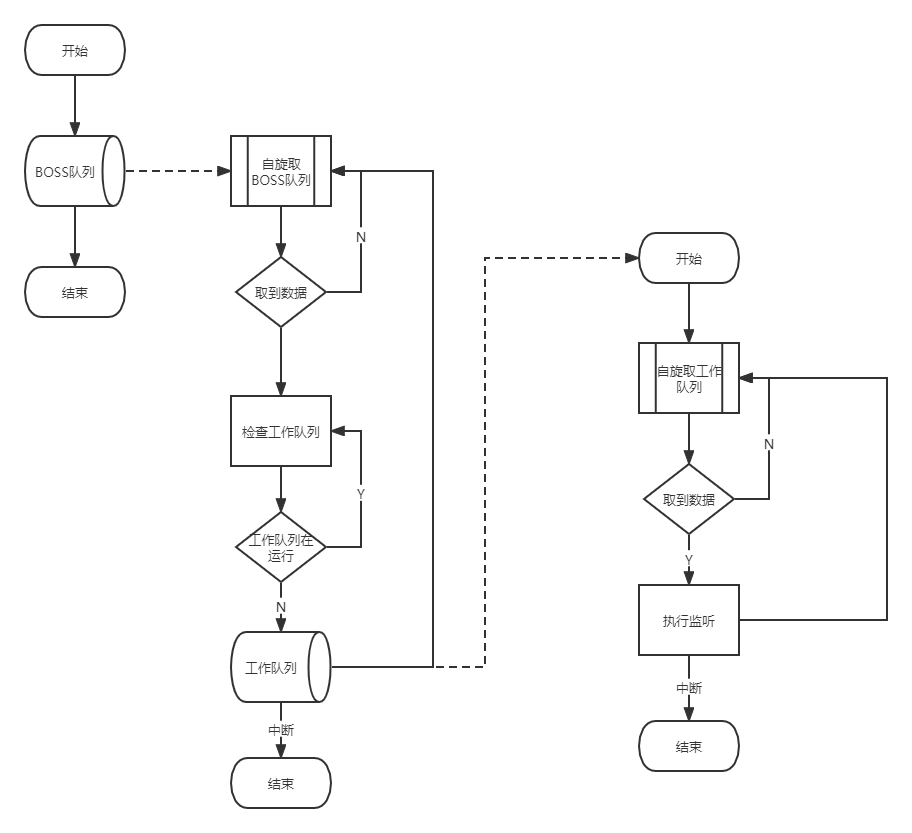

### 自旋处理QUEUE, 其实就是线程池


- 图1


```java

package wangjubao.base.common.concurrent;

import wangjubao.base.common.utils.PrintUtils;

import java.util.ArrayList;
import java.util.List;
import java.util.concurrent.BlockingQueue;
import java.util.concurrent.LinkedBlockingDeque;
import java.util.concurrent.LinkedBlockingQueue;
import java.util.concurrent.TimeUnit;
import java.util.logging.Level;
import java.util.logging.Logger;

/**
 * 快速并发处理的队列,
 * 适用于大数据量无序化的队列
 *
 * @author xionger
 * @version 2.0
 */
public class FastConcurrentQueue2<T> {

    Logger logger = Logger.getLogger(FastConcurrentQueue2.class.getSimpleName());

    private int maxCapacity;

    private int maxQueueCapacity;

    private int count;

    private T destorySingal;

    List<BlockingQueue<T>> dataQueue;

    List<ProcessRunnable> threadQueue;

    // 元数据, 当消息被触发的时候, 将会传递元数据过去.
    private Object mateData = null;

    private FastConcurrentPutListener<T> listener = null;

    BlockingQueue<T> taskQueue;

    public FastConcurrentQueue2(FastConcurrentPutListener<T> listener, T destoryTarget, Object mateData) {
        this(10, 1, listener, destoryTarget, mateData);
    }

    public FastConcurrentQueue2(int maxCapacity, int maxQueueCapacity, FastConcurrentPutListener<T> listener, T destoryTarget, Object mateData) {
        if (maxCapacity <= 0 || maxQueueCapacity <= 0) {
            throw new RuntimeException("最大的数量和最大的数据队列数量不能为空");
        }
        if (null == destoryTarget) {
            throw new RuntimeException("摧毁线程的标识一定要存在!");
        }
        this.maxCapacity = maxCapacity;
        this.maxQueueCapacity = maxQueueCapacity;
        this.destorySingal = destoryTarget;
        this.mateData = mateData;
        this.listener = listener;
        taskQueue = new LinkedBlockingQueue<>();
        initThreadQueue();
    }

    public void put(T data) {
        try {
            taskQueue.put(data);
        } catch (InterruptedException e) {
            logger.log(Level.WARNING, "快速并发队列出现了问题", e);
            throw new RuntimeException(e);
        }
    }

    public int getMaxCapacity() {
        return maxCapacity;
    }

    public void setMaxCapacity(int maxCapacity) {
        this.maxCapacity = maxCapacity;
    }

    public int getMaxQueueCapacity() {
        return maxQueueCapacity;
    }

    public void setMaxQueueCapacity(int maxQueueCapacity) {
        this.maxQueueCapacity = maxQueueCapacity;
    }

    public T getDestorySingal() {
        return destorySingal;
    }

    public void setDestorySingal(T destorySingal) {
        this.destorySingal = destorySingal;
    }

    public Object getMateData() {
        return mateData;
    }

    public void setMateData(Object mateData) {
        this.mateData = mateData;
    }

    public FastConcurrentPutListener<T> getListener() {
        return listener;
    }

    public void setListener(FastConcurrentPutListener<T> listener) {
        this.listener = listener;
    }

    public void destory() {
        for (int i = 0; i < maxCapacity; i++) {
            BlockingQueue<T> data = dataQueue.get(i);
            try {
                data.put(destorySingal);
            } catch (InterruptedException e) {
                logger.log(Level.WARNING, "插入数据时候,线程中断", e);
            }
        }
    }

    // 初始化线程队列
    private void initThreadQueue() {
        dataQueue = new ArrayList<>(maxCapacity);
        threadQueue = new ArrayList<>(maxCapacity);
        for (int i = 0; i < maxCapacity; i++) {
            BlockingQueue<T> queue = new LinkedBlockingDeque<>(maxQueueCapacity);
            dataQueue.add(queue);
            ProcessRunnable process = new ProcessRunnable(queue);
            threadQueue.add(process);
            new Thread(process).start();
        }
        //启动监听队列,新增
        new Thread(new ListenQueue()).start();
    }

    class ListenQueue implements Runnable {

        @Override
        public void run() {

            int k = -1;
            while (true) {
                T poll = null;
                try {
                    poll = taskQueue.poll(5, TimeUnit.SECONDS);
                } catch (InterruptedException e) {
                    e.printStackTrace();
                    break;
                }

                // 这个只有在进程结束的时候才会中断。
                if (Thread.currentThread().isInterrupted()) {
                    break;
                }

                if (null == poll) {
                    continue;
                }

                //终止条件，maxCapacity个false
                t1:
                while (true) {
                    for (int i = k + 1; i < maxCapacity; i++) {
                        ProcessRunnable processRunnable = threadQueue.get(i);
                        if (processRunnable.run) {
                            continue;
                        }
                        BlockingQueue<T> ts = dataQueue.get(i);
                        try {
                            ts.put(poll);
                            k = i;
                        } catch (InterruptedException e) {
                            e.printStackTrace();
                        }
                        break t1;
                    }
                    k = -1;
                }
            }
        }
    }


    class ProcessRunnable implements Runnable {
        private BlockingQueue<T> rowQueue = null;

        volatile boolean run;


        public ProcessRunnable(BlockingQueue<T> queue) {
            this.rowQueue = queue;
        }

        @Override
        public void run() {
            while (true) {
                T data = null;
                run = false;
                try {
                    data = rowQueue.poll(5, TimeUnit.SECONDS);
                } catch (InterruptedException e) {
                    logger.log(Level.WARNING, "取出数据得时候出现问题", e);
                }
                if (null == data) {
                    continue;
                }
                if (destorySingal.equals(data)) {
                    // 中止信号
                    logger.info(PrintUtils.print("检测到线程退出信号, 线程%s退出", Thread.currentThread().getName()));
                    break;
                }
                if (listener != null) {
                    run = true;
                    listener.put(mateData, data);
                }
            }
        }
    }
}


```