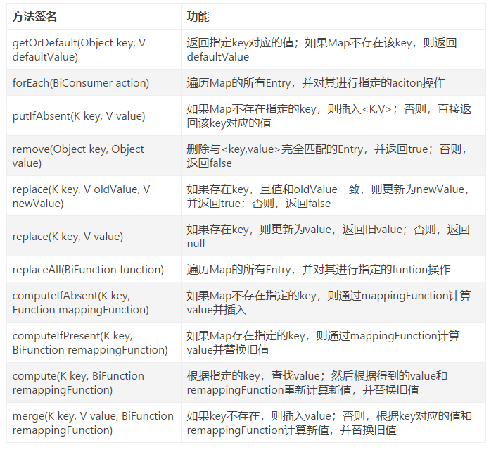

### ConcurrentHashMap是java.util.concurrent(并发包)下面一个具有分段锁的线程安全的高效Map。

#### 理论基础-基于1.8
1. 存储结构与HashMap类似。都是数组加链表，但是粒度要更细。 
2. 相比1.7来说Segment更加弱化，虽然内部还有定义，但仅仅是为了保证序列化时的兼容性，不再有结构上的用处
3. 数据存储利用volitile来保证可见性
4. 使用CAS操作，在特定场景进行无锁并发操作
5. 使用Unsafe、LongAdder之类底层手段，进行优化

#### 主要API
- 

#### 初始化，并不会再new的时候initTable()，会在第一次put，get的时候出现
```
    private final Node<K,V>[] initTable() {
        Node<K,V>[] tab; int sc;
        //初始化table没有new
        while ((tab = table) == null || tab.length == 0) {
            //如果发生hash冲突，等待(spin - 自旋锁)
            if ((sc = sizeCtl) < 0)
                Thread.yield(); // lost initialization race; just spin
                // CAS成功返回true，则进入真正的初始化逻辑
            else if (U.compareAndSwapInt(this, SIZECTL, sc, -1)) {
                try {
                    if ((tab = table) == null || tab.length == 0) {
                        //初始化长度16
                        int n = (sc > 0) ? sc : DEFAULT_CAPACITY;
                        @SuppressWarnings("unchecked")
                        Node<K,V>[] nt = (Node<K,V>[])new Node<?,?>[n];
                        table = tab = nt;
                        sc = n - (n >>> 2);
                    }
                } finally {
                    sizeCtl = sc;
                }
                break;
            }
        }
        return tab;
    }
```


#### put：简单的放入和覆盖和putIfAbsent：key不存在放入，存在不覆盖

```
    /** Implementation for put and putIfAbsent put的时候onlyIfAbsent为false:putIfAbsent的时候onlyIfAbsent为true  */
    final V putVal(K key, V value, boolean onlyIfAbsent) {
        if (key == null || value == null) throw new NullPointerException();
        //计算哈希
        int hash = spread(key.hashCode());
        int binCount = 0;
        for (Node<K,V>[] tab = table;;) {
            Node<K,V> f; int n, i, fh;
            //tab为空初始化
            if (tab == null || (n = tab.length) == 0)
                tab = initTable();
            else if ((f = tabAt(tab, i = (n - 1) & hash)) == null) {
                //利用cas去进行无锁线程安全操作
                if (casTabAt(tab, i, null,
                             new Node<K,V>(hash, key, value, null)))
                    break;                   // no lock when adding to empty bin
            }
            else if ((fh = f.hash) == MOVED)
                //并发扩容
                tab = helpTransfer(tab, f);
            else {
                //操作值
                V oldVal = null;
                synchronized (f) {
                    //unsafe
                    if (tabAt(tab, i) == f) {
                        if (fh >= 0) {
                            binCount = 1;
                            for (Node<K,V> e = f;; ++binCount) {
                                K ek;
                                if (e.hash == hash &&
                                    ((ek = e.key) == key ||
                                     (ek != null && key.equals(ek)))) {
                                    oldVal = e.val;
                                     //put key存在 覆盖值  putIfAbsent 不覆盖值
                                    if (!onlyIfAbsent)
                                        e.val = value;
                                    break;
                                }
                                //key不存在 add
                                Node<K,V> pred = e;
                                if ((e = e.next) == null) {
                                    pred.next = new Node<K,V>(hash, key,
                                                              value, null);
                                    break;
                                }
                            }
                        }
                        else if (f instanceof TreeBin) {
                            Node<K,V> p;
                            binCount = 2;
                            if ((p = ((TreeBin<K,V>)f).putTreeVal(hash, key,
                                                           value)) != null) {
                                oldVal = p.val;
                                if (!onlyIfAbsent)
                                    p.val = value;
                            }
                        }
                    }
                }
                if (binCount != 0) {
                    if (binCount >= TREEIFY_THRESHOLD)
                    //创建树
                        treeifyBin(tab, i);
                    if (oldVal != null)
                        return oldVal;
                    break;
                }
            }
        }
        addCount(1L, binCount);
        return null;
    }

```

#### get
```
   /**
     * Returns the value to which the specified key is mapped,
     * or {@code null} if this map contains no mapping for the key.
     *
     * <p>More formally, if this map contains a mapping from a key
     * {@code k} to a value {@code v} such that {@code key.equals(k)},
     * then this method returns {@code v}; otherwise it returns
     * {@code null}.  (There can be at most one such mapping.)
     *
     * @throws NullPointerException if the specified key is null
     */
    public V get(Object key) {
        Node<K,V>[] tab; Node<K,V> e, p; int n, eh; K ek;
        //计算key的hash值
        int h = spread(key.hashCode());
        //数组不为null且长度大于0，并且key的hash值所处的segement不为null
        if ((tab = table) != null && (n = tab.length) > 0 &&
            (e = tabAt(tab, (n - 1) & h)) != null) {
            //hash值相等
            if ((eh = e.hash) == h) {
            //key也相等
                if ((ek = e.key) == key || (ek != null && key.equals(ek)))
                    return e.val;
            }
            //hash值小于0，去链表里面找
            else if (eh < 0)
                return (p = e.find(h, key)) != null ? p.val : null;
                //防止并发再找一遍？
            while ((e = e.next) != null) {
                if (e.hash == h &&
                    ((ek = e.key) == key || (ek != null && key.equals(ek))))
                    return e.val;
            }
        }
        return null;
    }
```

#### remove 调用replaceNode(key, null, null);
```
   /**
     * Implementation for the four public remove/replace methods:
     * Replaces node value with v, conditional upon match of cv if
     * non-null.  If resulting value is null, delete. 
     */
    final V replaceNode(Object key, V value, Object cv) {
        int hash = spread(key.hashCode());
        for (Node<K,V>[] tab = table;;) {
            Node<K,V> f; int n, i, fh;
            //数组为空或者长度为0或者或者key的hash值所处的segement为null
            if (tab == null || (n = tab.length) == 0 ||
                (f = tabAt(tab, i = (n - 1) & hash)) == null)
                break;
                //MOVED== -1 。如果hash值计算出来的位置是第一个，转移
            else if ((fh = f.hash) == MOVED)
                tab = helpTransfer(tab, f);
            else {
                V oldVal = null;
                boolean validated = false;
                //加锁
                synchronized (f) {
                //segement的第一个位置没有发生变化
                    if (tabAt(tab, i) == f) {
                    //节点hash值 发生变化
                        if (fh >= 0) {
                            validated = true;
                            //循环
                            for (Node<K,V> e = f, pred = null;;) {
                                K ek;
                                //节点的hash值和key的hash值相等并且节点和key相等
                                if (e.hash == hash &&
                                    ((ek = e.key) == key ||
                                     (ek != null && key.equals(ek)))) {
                                    V ev = e.val;
                                    //节点的value不为null节点的value和key的value相等
                                    if (cv == null || cv == ev ||
                                        (ev != null && cv.equals(ev))) {
                                        oldVal = ev;
                                        //删除节点信息(改变指针指向)
                                        if (value != null)
                                            e.val = value;
                                        else if (pred != null)
                                            pred.next = e.next;
                                        else
                                            setTabAt(tab, i, e.next);
                                    }
                                    break;
                                }
                                pred = e;
                                if ((e = e.next) == null)
                                    break;
                            }
                        }
                        //为树的类型
                        else if (f instanceof TreeBin) {
                            validated = true;
                            TreeBin<K,V> t = (TreeBin<K,V>)f;
                            TreeNode<K,V> r, p;
                            //根节点不为null,并且key所处的节点不为null
                            if ((r = t.root) != null &&
                                (p = r.findTreeNode(hash, key, null)) != null) {
                                V pv = p.val;
                                //节点的hash值和key的hash值相等并且节点和key相等
                                if (cv == null || cv == pv ||
                                    (pv != null && cv.equals(pv))) {
                                    oldVal = pv;
                                    //改变指向
                                    if (value != null)
                                        p.val = value;
                                    else if (t.removeTreeNode(p))
                                        setTabAt(tab, i, untreeify(t.first));
                                }
                            }
                        }
                    }
                }
                //成功，并且oldVal和value都不为null,长度-1
                if (validated) {
                    if (oldVal != null) {
                        if (value == null)
                            addCount(-1L, -1);
                        return oldVal;
                    }
                    break;
                }
            }
        }
        return null;
    }
```

#### size
```
   /**
     * {@inheritDoc}
     */
    public int size() {
    //计算值
        long n = sumCount();
        return ((n < 0L) ? 0 :
                (n > (long)Integer.MAX_VALUE) ? Integer.MAX_VALUE :
                (int)n);
    }
```

#### compute  public V compute(K key,BiFunction<? super K, ? super V, ? extends V> remappingFunction)。key存在，覆盖value并返回,key不存在新建value并返回。
```
 /**
     * Attempts to compute a mapping for the specified key and its
     * current mapped value (or {@code null} if there is no current
     * mapping). The entire method invocation is performed atomically.
     * Some attempted update operations on this map by other threads
     * may be blocked while computation is in progress, so the
     * computation should be short and simple, and must not attempt to
     * update any other mappings of this Map.
     *
     * @param key key with which the specified value is to be associated
     * @param remappingFunction the function to compute a value
     * @return the new value associated with the specified key, or null if none
     * @throws NullPointerException if the specified key or remappingFunction
     *         is null
     * @throws IllegalStateException if the computation detectably
     *         attempts a recursive update to this map that would
     *         otherwise never complete
     * @throws RuntimeException or Error if the remappingFunction does so,
     *         in which case the mapping is unchanged
     */
    public V compute(K key,
                     BiFunction<? super K, ? super V, ? extends V> remappingFunction) {
        if (key == null || remappingFunction == null)
            throw new NullPointerException();
            //计算hash值
        int h = spread(key.hashCode());
        V val = null;
        int delta = 0;
        int binCount = 0;
        //循环
        for (Node<K,V>[] tab = table;;) {
            Node<K,V> f; int n, i, fh;
            //数组长度为null或者长度==0 创建数组
            if (tab == null || (n = tab.length) == 0)
                tab = initTable();
                //如果key的hash值对应的输出为null 创建segement
            else if ((f = tabAt(tab, i = (n - 1) & h)) == null) {
                Node<K,V> r = new ReservationNode<K,V>();
                synchronized (r) {
                //基于cas更新i节点的值
                    if (casTabAt(tab, i, null, r)) {
                        binCount = 1;
                        Node<K,V> node = null;
                        try {
                        //remappingFunction 传入的值不为空,复制
                            if ((val = remappingFunction.apply(key, null)) != null) {
                                delta = 1;
                                node = new Node<K,V>(h, key, val, null);
                            }
                        } finally {
                            setTabAt(tab, i, node);
                        }
                    }
                }
                if (binCount != 0)
                    break;
            }
            //如果是对应segement的第一位的话，转换
            else if ((fh = f.hash) == MOVED)
                tab = helpTransfer(tab, f);
            else {
                synchronized (f) {
                //获取table的i的数组是否跟f相等
                    if (tabAt(tab, i) == f) {
                    //数组的hash大于0
                        if (fh >= 0) {
                            binCount = 1;
                            //循环
                            for (Node<K,V> e = f, pred = null;; ++binCount) {
                                K ek;
                                //节点的hash值和key的hash值相等并且节点和key相等
                                if (e.hash == h &&
                                    ((ek = e.key) == key ||
                                     (ek != null && key.equals(ek)))) {
                                    val = remappingFunction.apply(key, e.val);
                                    //赋值(改变指针)
                                    if (val != null)
                                        e.val = val;
                                    else {
                                        delta = -1;
                                        Node<K,V> en = e.next;
                                        if (pred != null)
                                            pred.next = en;
                                        else
                                            setTabAt(tab, i, en);
                                    }
                                    break;
                                }
                                pred = e;
                                //key不存在，新建一个，并把key的下一个指针之下创建的
                                if ((e = e.next) == null) {
                                    val = remappingFunction.apply(key, null);
                                    if (val != null) {
                                        delta = 1;
                                        pred.next =
                                            new Node<K,V>(h, key, val, null);
                                    }
                                    break;
                                }
                            }
                        }
                        //如果是树
                        else if (f instanceof TreeBin) {
                            binCount = 1;
                            TreeBin<K,V> t = (TreeBin<K,V>)f;
                            TreeNode<K,V> r, p;
                            //根节点为kong，直接创建并赋值
                            if ((r = t.root) != null)
                                p = r.findTreeNode(h, key, null);
                            else
                                p = null;
                            V pv = (p == null) ? null : p.val;
                            val = remappingFunction.apply(key, pv);
                            //为空，创建tree
                            if (val != null) {
                                if (p != null)
                                    p.val = val;
                                else {
                                    delta = 1;
                                    t.putTreeVal(h, key, val);
                                }
                            }
                            //不为空，删除并覆盖
                            else if (p != null) {
                                delta = -1;
                                if (t.removeTreeNode(p))
                                    setTabAt(tab, i, untreeify(t.first));
                            }
                        }
                    }
                }
                if (binCount != 0) {
                //阈值大于8扩充
                    if (binCount >= TREEIFY_THRESHOLD)
                        treeifyBin(tab, i);
                    break;
                }
            }
        }
        //改变size
        if (delta != 0)
            addCount((long)delta, binCount);
        return val;
    }
```

#### computeIfAbsent。public V computeIfAbsent(K key, Function<? super K, ? extends V> mappingFunction)。 key存在，返回value,key不存在新建mappingFunction的value并返回。
```
/**
     * If the specified key is not already associated with a value,
     * attempts to compute its value using the given mapping function
     * and enters it into this map unless {@code null}.  The entire
     * method invocation is performed atomically, so the function is
     * applied at most once per key.  Some attempted update operations
     * on this map by other threads may be blocked while computation
     * is in progress, so the computation should be short and simple,
     * and must not attempt to update any other mappings of this map.
     *
     * @param key key with which the specified value is to be associated
     * @param mappingFunction the function to compute a value
     * @return the current (existing or computed) value associated with
     *         the specified key, or null if the computed value is null
     * @throws NullPointerException if the specified key or mappingFunction
     *         is null
     * @throws IllegalStateException if the computation detectably
     *         attempts a recursive update to this map that would
     *         otherwise never complete
     * @throws RuntimeException or Error if the mappingFunction does so,
     *         in which case the mapping is left unestablished
     */
    public V computeIfAbsent(K key, Function<? super K, ? extends V> mappingFunction) {
        if (key == null || mappingFunction == null)
            throw new NullPointerException();
             //计算hash值
        int h = spread(key.hashCode());
        V val = null;
        int binCount = 0;
        //循环
        for (Node<K,V>[] tab = table;;) {
            Node<K,V> f; int n, i, fh;
            //数组长度为null或者长度==0 创建数组
            if (tab == null || (n = tab.length) == 0)
                tab = initTable();
                //如果key的hash值对应的输出为null 创建segement
            else if ((f = tabAt(tab, i = (n - 1) & h)) == null) {
                Node<K,V> r = new ReservationNode<K,V>();
                synchronized (r) {
                //基于cas更新i节点的值
                    if (casTabAt(tab, i, null, r)) {
                        binCount = 1;
                        Node<K,V> node = null;
                        try {
                        //创建新node并保存
                            if ((val = mappingFunction.apply(key)) != null)
                                node = new Node<K,V>(h, key, val, null);
                        } finally {
                            setTabAt(tab, i, node);
                        }
                    }
                }
                if (binCount != 0)
                    break;
            }
            //如果是对应segement的第一位的话，转换
            else if ((fh = f.hash) == MOVED)
                tab = helpTransfer(tab, f);
            else {
                boolean added = false;
                synchronized (f) {
                //segemnt是否一样
                    if (tabAt(tab, i) == f) {
                        if (fh >= 0) {
                            binCount = 1;
                            for (Node<K,V> e = f;; ++binCount) {
                                K ek; V ev;
                                 //节点的hash值和key的hash值相等并且节点和key相等
                                if (e.hash == h &&
                                    ((ek = e.key) == key ||
                                     (ek != null && key.equals(ek)))) {
                                    val = e.val;
                                    break;
                                }
                                Node<K,V> pred = e;
                                //key不存在，新建一个，并把key的下一个指针之下创建的
                                if ((e = e.next) == null) {
                                    if ((val = mappingFunction.apply(key)) != null) {
                                        added = true;
                                        pred.next = new Node<K,V>(h, key, val, null);
                                    }
                                    break;
                                }
                            }
                        }
                        //如果是树
                        else if (f instanceof TreeBin) {
                            binCount = 2;
                            TreeBin<K,V> t = (TreeBin<K,V>)f;
                            TreeNode<K,V> r, p;
                            //根节点不为Null并且对应的key的节点存在，返回节点的值
                            if ((r = t.root) != null &&
                                (p = r.findTreeNode(h, key, null)) != null)
                                val = p.val;
                                //创建新节点
                            else if ((val = mappingFunction.apply(key)) != null) {
                                added = true;
                                t.putTreeVal(h, key, val);
                            }
                        }
                    }
                }
                //阈值大于8扩充
                if (binCount != 0) {
                    if (binCount >= TREEIFY_THRESHOLD)
                        treeifyBin(tab, i);
                    if (!added)
                        return val;
                    break;
                }
            }
        }
        //改变size
        if (val != null)
            addCount(1L, binCount);
        return val;
    }
```

#### computeIfPresent。public V computeIfPresent(K key, BiFunction<? super K, ? super V, ? extends V> remappingFunction) key存在，remappingFunction的value覆盖value并返回，key不存在，不操作
```
 /**
     * If the value for the specified key is present, attempts to
     * compute a new mapping given the key and its current mapped
     * value.  The entire method invocation is performed atomically.
     * Some attempted update operations on this map by other threads
     * may be blocked while computation is in progress, so the
     * computation should be short and simple, and must not attempt to
     * update any other mappings of this map.
     *
     * @param key key with which a value may be associated
     * @param remappingFunction the function to compute a value
     * @return the new value associated with the specified key, or null if none
     * @throws NullPointerException if the specified key or remappingFunction
     *         is null
     * @throws IllegalStateException if the computation detectably
     *         attempts a recursive update to this map that would
     *         otherwise never complete
     * @throws RuntimeException or Error if the remappingFunction does so,
     *         in which case the mapping is unchanged
     */
    public V computeIfPresent(K key, BiFunction<? super K, ? super V, ? extends V> remappingFunction) {
        if (key == null || remappingFunction == null)
            throw new NullPointerException();
             //计算hash值
        int h = spread(key.hashCode());
        V val = null;
        int delta = 0;
        int binCount = 0;
        //循环
        for (Node<K,V>[] tab = table;;) {
            Node<K,V> f; int n, i, fh;
            //数组长度为null或者长度==0 创建数组
            if (tab == null || (n = tab.length) == 0)
                tab = initTable();
                //如果对应的segement为null
            else if ((f = tabAt(tab, i = (n - 1) & h)) == null)
                break;
                //如果对应的segement是第一个，转换
            else if ((fh = f.hash) == MOVED)
                tab = helpTransfer(tab, f);
            else {
                synchronized (f) {
                //segement存在
                    if (tabAt(tab, i) == f) {
                        if (fh >= 0) {
                            binCount = 1;
                            //循环
                            for (Node<K,V> e = f, pred = null;; ++binCount) {
                                K ek;
                                //节点的hash值和key的hash值相等并且节点和key相等
                                if (e.hash == h &&
                                    ((ek = e.key) == key ||
                                     (ek != null && key.equals(ek)))) {
                                    val = remappingFunction.apply(key, e.val);
                                    //赋值
                                    if (val != null)
                                        e.val = val;
                                    else {
                                        delta = -1;
                                        Node<K,V> en = e.next;
                                        if (pred != null)
                                            pred.next = en;
                                        else
                                            setTabAt(tab, i, en);
                                    }
                                    break;
                                }
                                pred = e;
                                //下个节点为Null
                                if ((e = e.next) == null)
                                    break;
                            }
                        }
                        //如果是树
                        else if (f instanceof TreeBin) {
                            binCount = 2;
                            TreeBin<K,V> t = (TreeBin<K,V>)f;
                            TreeNode<K,V> r, p;
                            //根节点不为null并且key的节点不为null
                            if ((r = t.root) != null &&
                                (p = r.findTreeNode(h, key, null)) != null) {
                                val = remappingFunction.apply(key, p.val);
                                //赋值
                                if (val != null)
                                    p.val = val;
                                    //删除节点
                                else {
                                    delta = -1;
                                    if (t.removeTreeNode(p))
                                        setTabAt(tab, i, untreeify(t.first));
                                }
                            }
                        }
                    }
                }
                if (binCount != 0)
                    break;
            }
        }
        //改变size
        if (delta != 0)
            addCount((long)delta, binCount);
        return val;
    }
```


#### merge。public V merge(K key, V value, BiFunction<? super V, ? super V, ? extends V> remappingFunction)。key不存在插入value,key存在插入remappingFunction的值
```
  /**
     * If the specified key is not already associated with a
     * (non-null) value, associates it with the given value.
     * Otherwise, replaces the value with the results of the given
     * remapping function, or removes if {@code null}. The entire
     * method invocation is performed atomically.  Some attempted
     * update operations on this map by other threads may be blocked
     * while computation is in progress, so the computation should be
     * short and simple, and must not attempt to update any other
     * mappings of this Map.
     *
     * @param key key with which the specified value is to be associated
     * @param value the value to use if absent
     * @param remappingFunction the function to recompute a value if present
     * @return the new value associated with the specified key, or null if none
     * @throws NullPointerException if the specified key or the
     *         remappingFunction is null
     * @throws RuntimeException or Error if the remappingFunction does so,
     *         in which case the mapping is unchanged
     */
    public V merge(K key, V value, BiFunction<? super V, ? super V, ? extends V> remappingFunction) {
        if (key == null || value == null || remappingFunction == null)
            throw new NullPointerException();
            //计算hash值
        int h = spread(key.hashCode());
        V val = null;
        int delta = 0;
        int binCount = 0;
        //循环
        for (Node<K,V>[] tab = table;;) {
            Node<K,V> f; int n, i, fh;
            //数组长度为null或者长度==0 创建数组
            if (tab == null || (n = tab.length) == 0)
                tab = initTable();
                //如果对应的segement为null
            else if ((f = tabAt(tab, i = (n - 1) & h)) == null) {
            //创建
                if (casTabAt(tab, i, null, new Node<K,V>(h, key, value, null))) {
                    delta = 1;
                    val = value;
                    break;
                }
            }
             //如果对应的segement是第一个，转换
            else if ((fh = f.hash) == MOVED)
                tab = helpTransfer(tab, f);
            else {
                synchronized (f) {
                //segemnt是否一样
                    if (tabAt(tab, i) == f) {
                        if (fh >= 0) {
                            binCount = 1;
                            //循环
                            for (Node<K,V> e = f, pred = null;; ++binCount) {
                                K ek;
                                //节点的hash值和key的hash值相等并且节点和key相等
                                if (e.hash == h &&
                                    ((ek = e.key) == key ||
                                     (ek != null && key.equals(ek)))) {
                                    val = remappingFunction.apply(e.val, value);
                                    //覆盖
                                    if (val != null)
                                        e.val = val;
                                    else {
                                        delta = -1;
                                        Node<K,V> en = e.next;
                                        if (pred != null)
                                            pred.next = en;
                                        else
                                            setTabAt(tab, i, en);
                                    }
                                    break;
                                }
                                pred = e;
                                //key不存在，新建一个，并把key的下一个指针之下创建的
                                if ((e = e.next) == null) {
                                    delta = 1;
                                    val = value;
                                    pred.next =
                                        new Node<K,V>(h, key, val, null);
                                    break;
                                }
                            }
                        }
                        //如果是树
                        else if (f instanceof TreeBin) {
                            binCount = 2;
                            TreeBin<K,V> t = (TreeBin<K,V>)f;
                            TreeNode<K,V> r = t.root;
                            //根==null 或者 等于key的node
                            TreeNode<K,V> p = (r == null) ? null :
                                r.findTreeNode(h, key, null);
                            val = (p == null) ? value :
                                remappingFunction.apply(p.val, value);
                            if (val != null) {
                                if (p != null)
                                //覆盖
                                    p.val = val;
                                else {
                                //创建新的
                                    delta = 1;
                                    t.putTreeVal(h, key, val);
                                }
                            }
                            //删除节点
                            else if (p != null) {
                                delta = -1;
                                if (t.removeTreeNode(p))
                                    setTabAt(tab, i, untreeify(t.first));
                            }
                        }
                    }
                }
                //阈值大于8扩充
                if (binCount != 0) {
                    if (binCount >= TREEIFY_THRESHOLD)
                        treeifyBin(tab, i);
                    break;
                }
            }
        }
        //改变size
        if (delta != 0)
            addCount((long)delta, binCount);
        return val;
    }

```