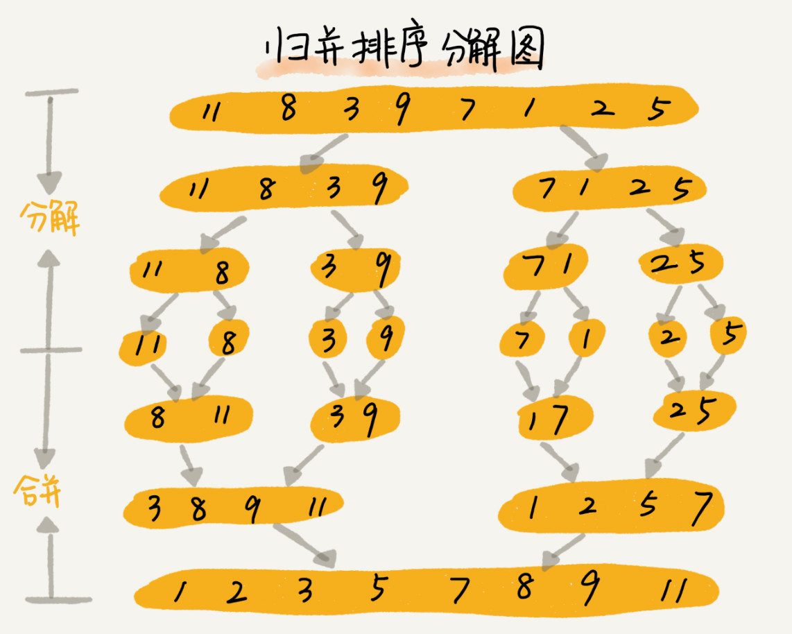

~~~
    /**
     * 归并排序
     * @param sort 数组
     * @param n 数组的长度
     */
    public static int[]  MergeSort(int[] sort, int n ){

        if(n == 0 ){
            return new int[0];
        }
        //分解到只有一个数的时候，直接返回该数，不继续分解
        if(n == 1){
            return sort;
        }
        //分解数
        int mid = n/2;
        int[] left = Arrays.copyOfRange(sort, 0 , mid);
        int[] right = Arrays.copyOfRange(sort, mid , n);

        //递归继续分解
        left = MergeSort(left,left.length);
        right = MergeSort(right,right.length);

        //数组进行合并
        int[] ints = Merge_Sort(left, right);

        return  ints;
    }

    public static int[]  Merge_Sort(int[] sortA , int[] sortB ){
        if(sortA == null || sortA.length == 0){
            sortA = new int[0];
        }

        if(sortB == null || sortB.length == 0){
            sortB = new int[0];
        }

        //组合后的数组
        int[] tempSort = new int[sortA.length+sortB.length];

        //a 表示 sortA的累加， b 表示sortB的累加 ，c 表示tempSort的累加
        int a =0, b= 0 ,c = 0;
        while(a <sortA.length && b<sortB.length){
            if(sortA[a] < sortB[b]){
                tempSort[c]=sortA[a];
                a++;
            }else {
                tempSort[c]=sortB[b];
                b++;
            }
            c++;
        }

        //防止某个sort.length = 0 的时候，另一个lenth > 0
        if(a <sortA.length){
            for(int i = a ; i< sortA.length ; i++){
                tempSort[c] = sortA[i];
                c++;
            }
        }else {
            for(int i = b ; i< sortB.length ; i++){
                tempSort[c] = sortB[i];
                c++;
            }
        }

        return tempSort;
    }

~~~