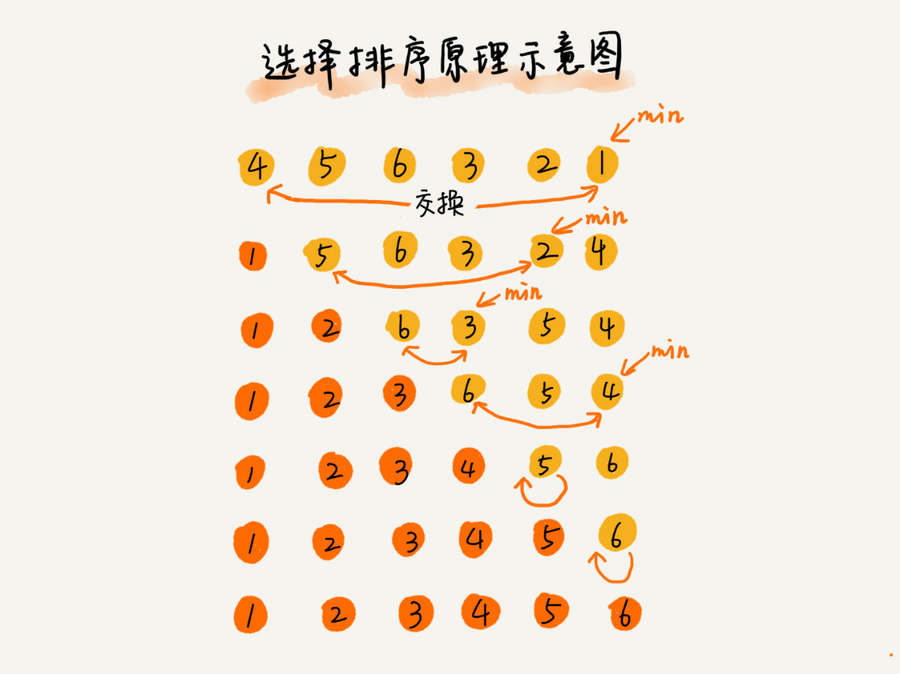

    

~~~
/**
     *  选择排序
     * @param a 数组
     * @param n 数组长度
     */
    public static void selectionSort(int[] a , int n){
           if(n<1){
               return;
           }
        
            for(int i = 0 ; i<n-1 ; i++){
                int k = i ;
                for(int j = i+1;j<n;j++){
                    if(sort[j]<sort[i]){
                        //索引交换
                        k=j;
                    }
                }
                if(i != k ){
                    //数据交换
                    int temp = sort[k];
                    sort[k]=sort[i];
                    sort[i]=temp;
                }
            }
    }

~~~